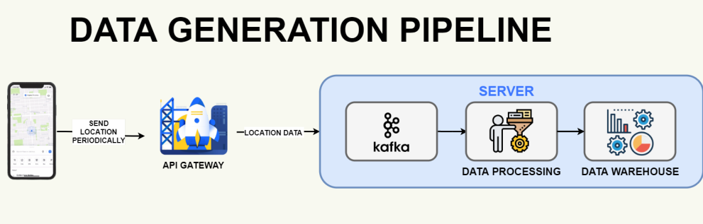
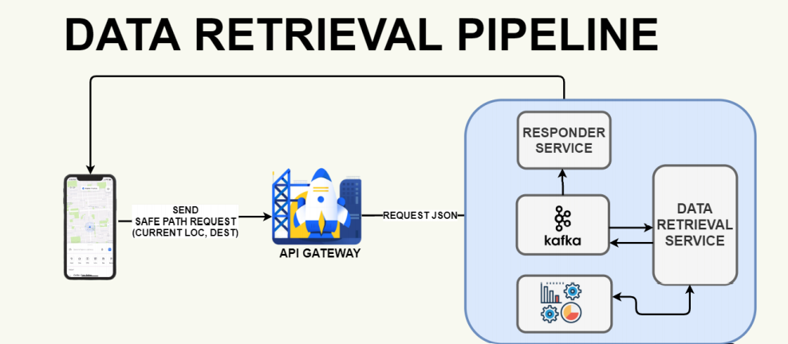
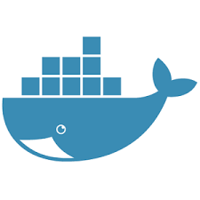

# 🦠**PPCS: Post Pandemic Crowd Safety** 💉😷

## 🤔❓ **_Impact of COVID-19 In India_** 🙋‍♂️🙋‍♀️

The world is going through one of the worst pandemics ever seen. After concurrent lockdowns as the government is easing out, more and more people are heading towards the streets and are on the verge of risking their lives there is a need to alert people about the areas where the crowd is denser and could potentially be risky to travel via, any declared Hotspot zones that the user might be unaware of.

Coronavirus disease (COVID-19) pandemic has spread to 198 countries, with approximately 2.4 million confirmed cases and 150,000 deaths globally as of April 18. Frontline healthcare workers (HCWs) face a substantially higher risk of infection and death due to excessive COVID-19 exposure

## 🩺👨‍⚕️ _**Our Proposal**_

- Initially, we are aiming to create an
  application that crowdsources data and
  alert people about the areas where the
  crowd is denser and could potentially be
  risky to travel via.

- In future, the system will automatically
  detect and provide the safest path from
  source to destination. Hence controlling
  the spread in a better way and saving
  more lives as a result.

- The app presents a minimalistic
  design pattern that enables
  everyone to understand and
  use the application with ease

## 📺 _**Demo Gif**_

#### 😼  Hotspot Zone Detection & Safest Route Detection

#### 🚧  Easy Errors for UX & Voice Search for ease of access

## ⚙ **Core Features:**

### 📮 Data Collection

- Every user that installs the app will provide the geo-location data which will be send to the server to be analyzed

### 🗄️ Organizing data for efficient processing

- Entire location data will be stored in the “DATA WAREHOUSE” to make it easier for the efficient retrieval of the data

### 🕵️‍♂️ Detecting Crowded Zones

- The organized data is further retrieved and algorithmically analyzed for detecting the hazardous zones

### 🚏 Safest Route Detection

- The server provides safest routes for an end user to travel via

## ✨**Special Features:**

### 🌊 Minimal User Interface

- The user should not be bogged with plethora of options but what he wants to see

### 📏 Scalable

- the back-end server will be extemely scalable to handle humongous amount of users

### ⚔️ Cross Platform

- by using flutter framework we can manage to develop our product on multiple platforms with single code-base

## 📕 **Achievements:**

- [x] BLoC Pattern Used
- [x] OAuth2 Authentication with JWT
- [x] Handle billions of users with ease
- [x] Industry Standard File Structure Pattern Used
- [x] Internet Connection Lost Error Handled
- [x] Good Interface Design
- [x] Internal Errors catched and Handled
- [x] Multi-Platform
- [x] Minimal Apk Size (7.2 MB)

## 🗼 **Architecture:**

## ⚙ **Steps to Start PPCS Server:**

1. Create a VM (Ubuntu server 20.02 LTS) (Ports to open: 8000)
2. [Install Docker](https://docs.docker.com/install/linux/docker-ce/ubuntu)
3. [Install Docker compose](https://docs.docker.com/compose/install)
4. Clone this repository 👆.
5. Change Directory to dependencies.
6. Run all the dependencies (Zookeeper, Kafka, PostgreSQL) at once with the command : `sudo docker-compose up -d`
7. Run command :`pip3 install -r requirements.txt`
8. Run `restart.py` Python file to set-up the dependencies automatically (Only to be done when starting PPCS for the first time).
9. Change Directory to starter
10. Run PPCS with the command : `sudo docker-compose up`
11. After the server has started use the application on your desired OS.

---

## 🔨 **Languages and Tools:**

 
 
 
 

## 👨‍🏫 **Team Mentor:**

- **Mrs Alankrita Aggarwal**

## 👥 **Team Members:**

- 👮‍♂️ **Pranav Taneja (LEADER)**
- 💂‍♂️ **Manan Arora**
- 👷‍♂️ **Abhay Mendiratta**

## 🔱 **Apk Link:**

- 🎃 **Check Releases** 👉

## 🔱 **GDrive Link for Resources:**

- 🎇 [**Zipped Source Code, PDFs & Demo Video here**](https://drive.google.com/drive/folders/1qmtGxikv7jGdRZgy9rHEuVkNUxkp_Qc3?usp=sharing)

## 🧐 **References:**

- [Flutter](https://flutter.dev)
- [Kafka](https://kafka.apache.org)
- [Docker](https://www.docker.com)
- [PostgreSQL](https://www.postgresql.org)
- [Numpy](https://numpy.org)
- [FastAPI](https://fastapi.tiangolo.com)
- [PsycoPg2](https://pypi.org/project/psycopg2)
